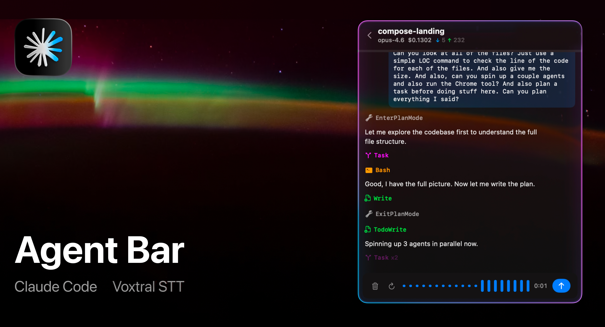

  
  <h1 align="center">AgentBar for macOS</h1>

  
  

AgentBar is a native macOS menu bar app for launching and managing AI coding sessions quickly without leaving your current workflow.

  

## Auto-updates

Auto-updates are enabled via [Sparkle](https://sparkle-project.org), so once installed, AgentBar can keep itself up to date automatically.

## Need help?

If you run into any issues, please open a GitHub issue:

- [Report a bug](https://github.com/Aayush9029/AgentBar/issues/new?template=bug_report.yml)
- [Request a feature](https://github.com/Aayush9029/AgentBar/issues/new?template=feature_request.yml)
